# Cartridge Casing Feature Labeling

Automating the labeling process of key features in cartridge casings can significantly reduce manual intervention, making the task more efficient and cost-effective. This project aims to automate the identification of five crucial features in cartridge casings using topographical data, specifically in .X3P format.

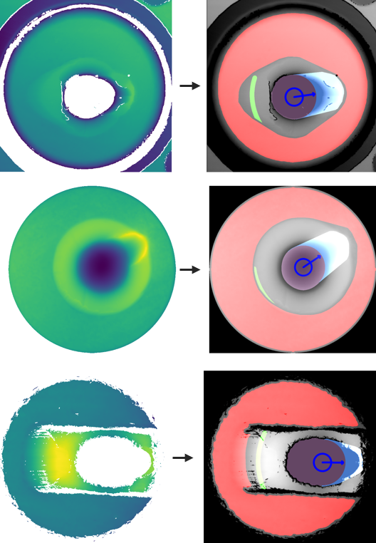

## Table of Contents

- [Requirements](#requirements)
- [Usage](#usage)
- [Overview](#overview)
  - [Key Features to Label](#key-features-to-label)
  - [Data Source](#data-source)
  - [Assumptions](#assumptions)
  - [Labelling Pipeline Overview](#labelling-pipeline-overview)
  - [Limitations](#limitations)
  - [Future Steps](#future-steps)

## Requirements

- python 3
- R
- tox (`python -m pip install tox`)

## Usage

1. Run `python -m tox` to initialize the project environment.
2. Add `.x3p` files to the `data/original` directory.
3. Run `convert_3d_to_df.r`.
4. Run `run.ipynb`.

## Overview

### Key Features to Label

1. Breech face impression
2. Aperture shear
3. Central firing pin impression
4. Firing pin drag
5. Direction of the drag

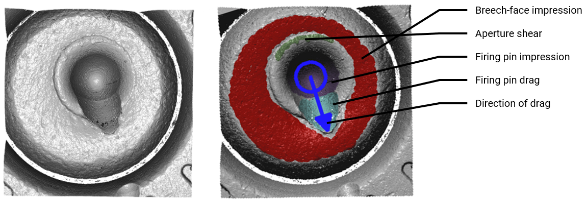

### Data Source

The project utilizes [NIST’s ballistics toolmark research database](https://tsapps.nist.gov/nrbtd), focusing on 3D topographical data for accurate elevation information in cartridge casings.

### Assumptions

To accurately label cartridge casings, the following assumptions are made:

- Topographical data in .X3P format
- Image cropped to primarily contain the primer region
- Square or nearly square image
- Limited missing data

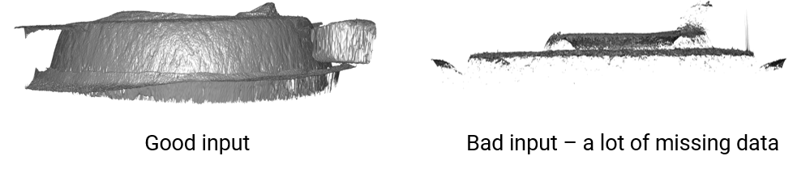

### Labelling Pipeline Overview

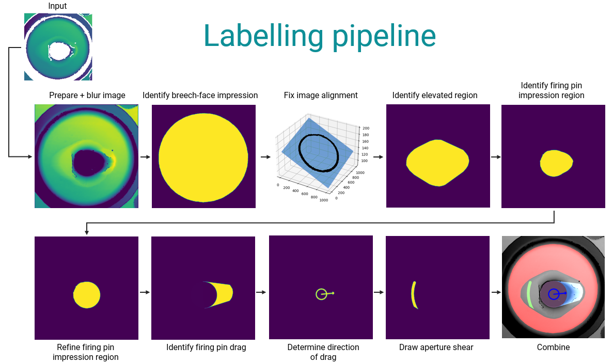

1. **Data Preparation:**

   - Standardize the format (crop, normalize, resize, replace null values, convert to uint8, apply gaussian blur).

2. **Breech-Face Impression Identification:**

   - Apply threshold to create a binary image.
   - Identify the largest contour, fill it, and erode/dilate to reduce noise.

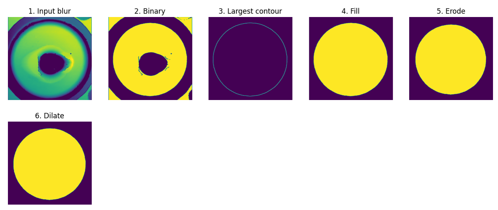

3. **Identifying Elevated Region:**

   - Create a ring around breech-face impression.
   - Apply regression to correct skewness.
   - Binarize, identify contours, apply convex hull, and fill.

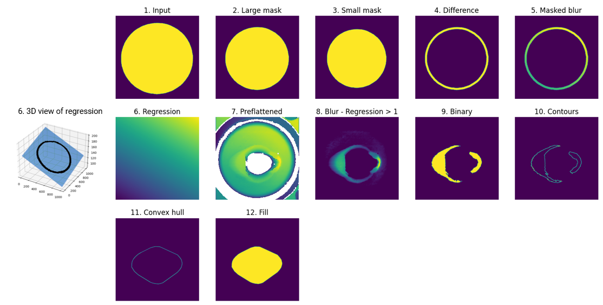

4. **Isolate Firing Pin Impression:**

   - Use the elevated region as a mask.
   - Apply binary threshold to identify contours in the firing pin impression area.

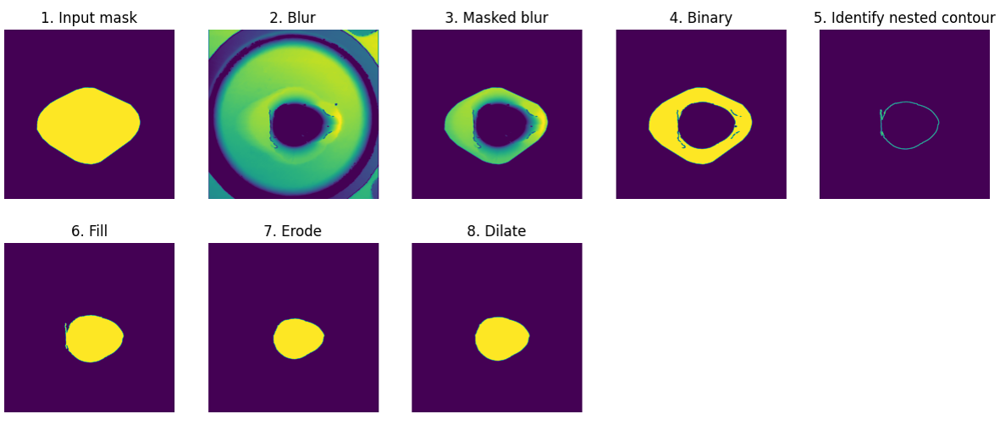

5. **Refine Firing Pin Impression:**

   - Draw the largest circle in the region.
   - Identify the drag direction and draw a perpendicular line.
   - Combine pin impression with the circle for a refined area.

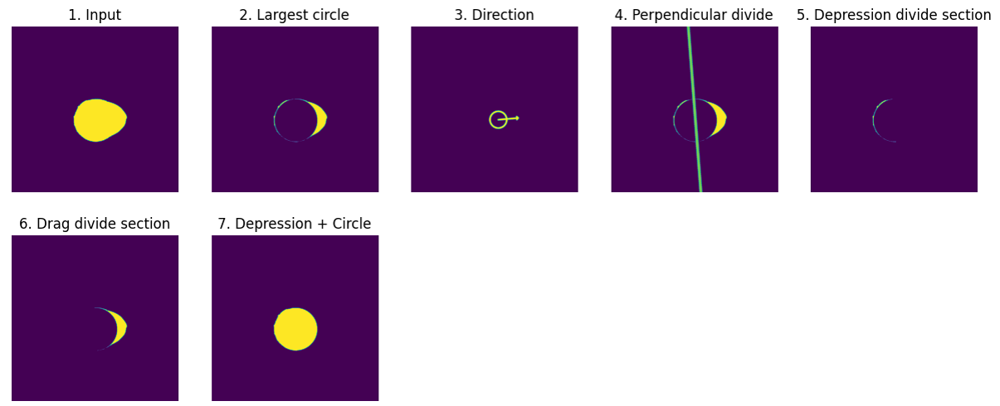

6. **Identify Firing Pin Drag Region:**

   - Use the perpendicular line to keep the region toward the drag direction.
   - Quantize the image, keep the top layer indicating the end of the drag region.
   - Combine with the refined pin impression, apply convex hull, and subtract the pin impression to obtain the drag region.

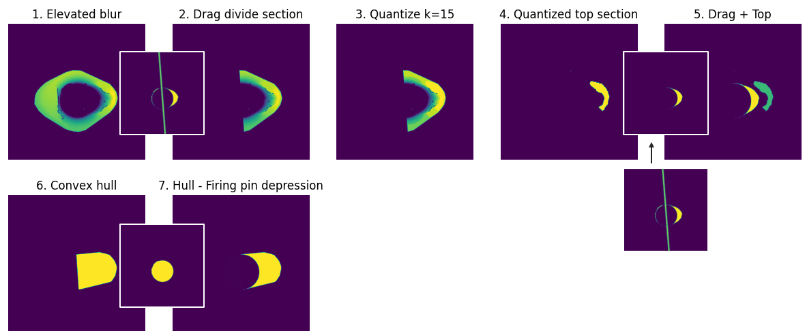

7. **Determine Drag Direction:**

   - Use centroid and orientation of the object to determine direction.

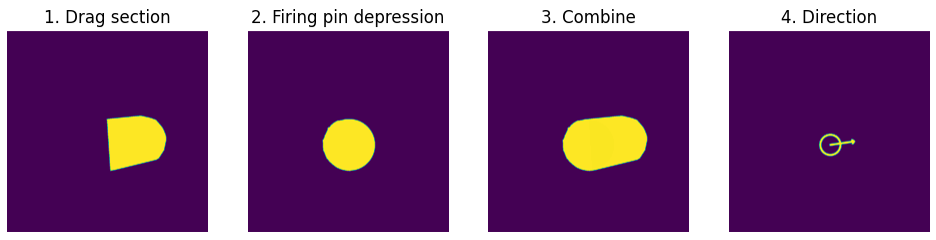

8.  **Draw Aperture Shear:**
   
   - Divide elevated region, quantize image, select top section, find contour, and draw an arc from the centroid to the furthest point.

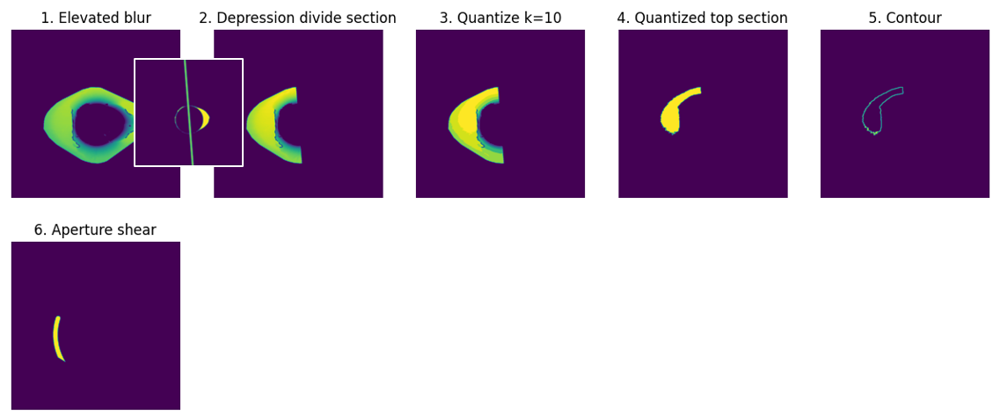

9.  **Combine Regions:**

   - Merge all identified sections to generate a final image with highlighted features.

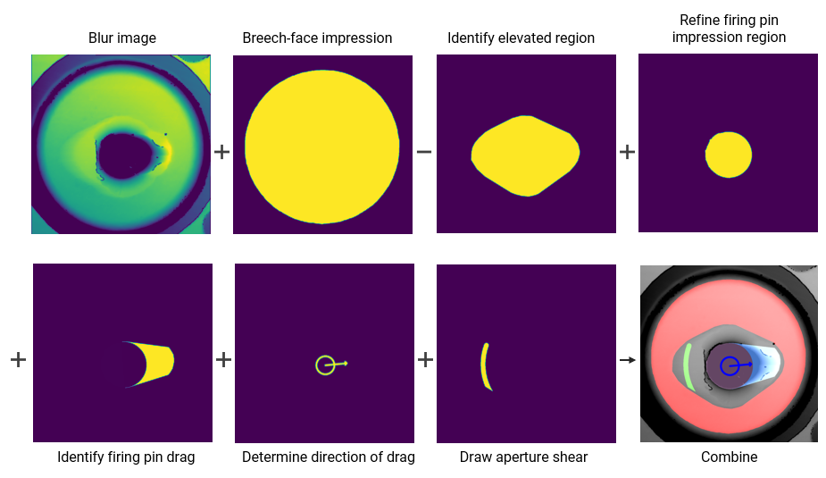

### Limitations

The approach may face challenges with topographical data containing significant missing information, impacting the accuracy of identifying firing pin or drag regions.

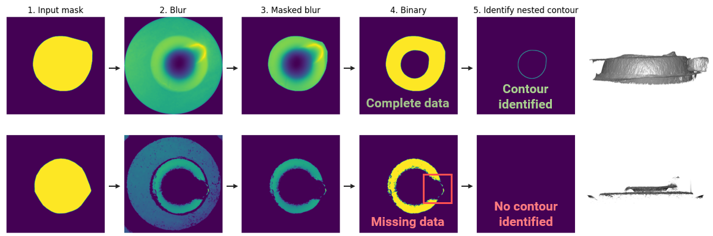

### Future Steps

1. Evaluate model performance using human-labeled reference images.
2. Adapt and test the algorithm on data collected using microscopes available at the Centre of Forensic Science’s, considering potential variations in data sources.